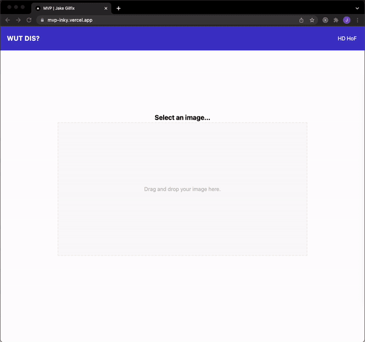

## About

This is a [Next.js](https://nextjs.org/) project bootstrapped with [`create-next-app`](https://github.com/vercel/next.js/tree/canary/packages/create-next-app). The inspiration for this project came from [this scene](https://www.youtube.com/watch?v=ACmydtFDTGs) in [Silicon Valley](https://www.imdb.com/title/tt2575988/?ref_=fn_al_tt_1).

This project makes use of [Nyckel's (free) image classification API](https://www.nyckel.com/) to classify food into the following categories:

- Hot Dog
- Not Hot Dog

## Preview



## Getting Started

First, run the development server:

```bash
npm run dev
```

Open [http://localhost:3000](http://localhost:3000) with your browser to see the result.
